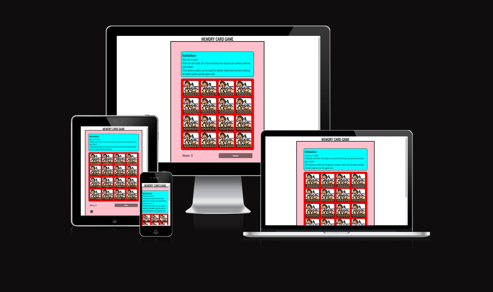
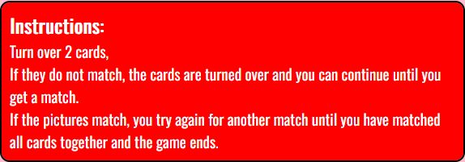
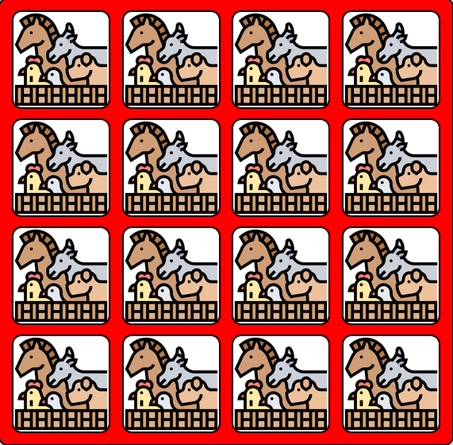
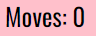
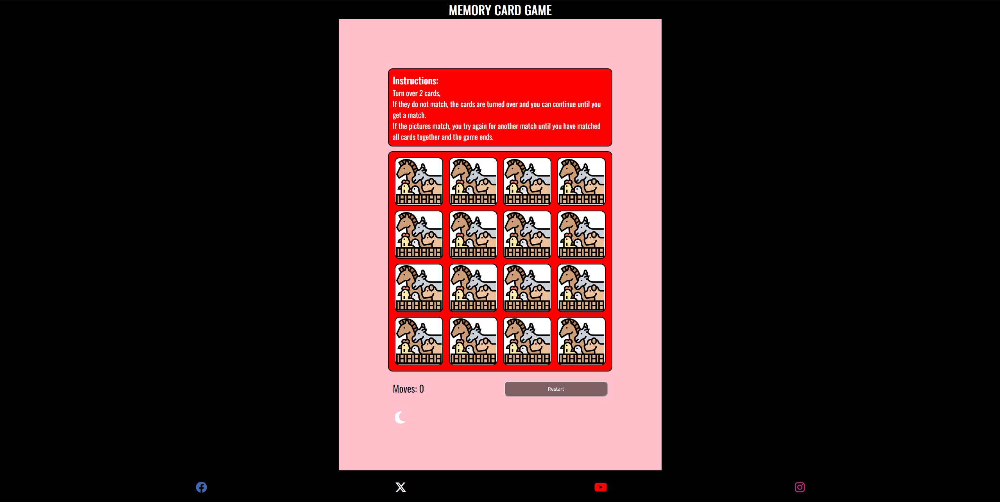
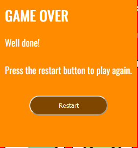

# Memory Card Game
 
Memory Card Game is a responsive website on a various number of devices that targets people who feel like playing a simple but still a memory challenging game.

[You can view this site here](https://shiaba.github.io/memory-card-game/)

## Content

* [Features](#features)
  * [Instructions part](#instructions-part)
  * [Main game](#main-game)
  * [Moves counter](#moves-counter)
  * [Restart button](#restart-button)
  * [Light & dark button](#light--dark-button)
  * [Footer](#footer)
  * [Whole page](#whole-page)
  * [Game over part](#game-over-part)
  * [Features scrapped](#features-scrapped)
  * [Features yet to add](#features-yet-to-add)
  * [Wireframe](#wireframe)

 

* [Issues & Bugs Encounters](#issues--bugs-encounters)
  * [Solved](#solved)
  * [Unsolved](#unsolved)

 

* [Testing](#testing)
  * [Validator testing](#validator-testing)
  * [Accessibility](#accessibility)

 

* [Deployment](#deployment)

 

* [Credits](#credits)

## Features
 

### Instructions part

  * Here you'll have short and descriptive instructions to read either before, during or after starting the game.
  * It is responsive during light or darkmode screen, so it is readable for the user whichever mode they decide to play on.

 

### Main game

  * Here is the main game where you'll try to match all the cards.
  * It has pretty good responsiveness with cute animal images and flip animations.

### Moves counter

  * The moves counter counts every 2 cards you flip.
  

### Restart button

  * The restart button reload the page for user to play again.

### Light & dark button

  * The page changes to dark page and white text for most of the page with certain exceptions & when changing to light the opposite.
  * The exceptions are the background color of the instructions part. It changes from red background & white text when on dark mode and cyan background with black text color when on light mode for easier readability.
  * The image of the button changes from a sun to a moon when pressed on.

 

### Footer

  * The footer shows 4 social media icons that opens an external link to that specific page if the user is interested and and wishes to see more of what is offered.

### Whole page

  * Here's how it looks as a whole (in darkmode) making it very easy to navigate through the page.
  * It is very minimal but has all it's functions at center and easily visible.

### Game over part

  * When matching all 16 cards together, the page will add a new little popup in the middle of the screen congratulating the user & offering user to restart and play again.
  * If restarting the popup will disappear and the user can play the game as before again.
  * When using light & dark mode during game over part, only the text will change color to white or black and the background will stay orange.

### Features scrapped

  * Timer: With little time left & not just wanting to add a timer without a purpose (like adding time results to leaderboard), I decided to scrap this idea and focus on other functions.
  * I scrapped the idea of adding the total amount of moves to game over screen because of little time left before deadline.
  * Stop button: Saw no point in having it without implementing a few more features.

### Features yet to add

  * Restart button only changes the game & not the whole page, which causes darkmode screen to change to lightmode everytime pressed.
  * Leaderboard where you can add your name & have your score be saved there.
  * Add some sound effects & music.

### Wireframe

  * This wireframe was drawn on paint for desktop. 
  * [Wireframe](/media/wireframe/wireframe.png)

## Issues & Bugs Encounters

### Solved

  * First bug - I had a problem where content passed through my footer and created unnecessary space when adding more to the body.
  * Second bug - When minimizing screen to phone size, 20% the footer disappeared into white space. I changed the max 400 media queary to fix that bug.
  * Third bug - When clicking on card after adding javaScript, only one image turned which caused two pictures to be showing at the same time. I changed the CSS transform: rotate(); on the back card to remedy that bug.
  * Fourth bug - When clicking on as many cards as possible during the flip, first: more than two could be clicked at. Second: cards that didn’t even match wouldn’t flip back if you had clicked at more than two.
  [Fouth bug: ~9min](https://www.youtube.com/watch?v=xWdkt6KSirw&list=PLA5ufyeK7gBWq_5oIuQ7Yz6FKHq5AuOEN&index=11)

### Unsolved

  * I encountered a bug where you can’t flip the first card you clicked on after the two cards flip back, and I have not solved that bug because of little time left on deadline.

## Testing

  * I tested if the page works on Microsoft edge, Chrome & Firefox.
  
### Validator testing

* CSS
  
  * CSS har an error warning concerning imported style sheet from google fonts.

[CSS w3c validator](media/w3c/css.png)

* HTML

  * No errors shown for HTML.

[HTML w3c validator](media/w3c/html.png)

* javaScript

  * Found no errors on one page & found 15 warnings on the jshint page.

[javaScript validator 1](media/w3c/javascript.png)

[jshint validator 2](media/w3c/jshint.png)

### Accessibility

* Lighthouse testing (Firefox)

[Firefox desktop](media/lighthouse/firefox-desktop.png)

[Firefox phone](media/lighthouse/firefox-phone.png)

* Lighthouse testing (Chrome)

[Google desktop](media/lighthouse/chrome-desktop.png)

[Google phone](media/lighthouse/chrome-phone.png)

## Deployment

* The site has been deployed to github. You can find it by:
  * Click project you want to see, go to setting.
  * From the source section drop-down menu, select the master branch.
  * Once selected, The page provides a link to the website.

 

  Or press the link [Here](https://shiaba.github.io/memory-card-game/)

## Credits

* Font awesome for social media kit icons:
  * Link for facebook [Icon](https://fontawesome.com/icons/facebook?f=brands&s=solid)
  * Link for twitter [Icon](https://fontawesome.com/icons/x-twitter?f=brands&s=solid)
  * Link for youtube [Icon](https://fontawesome.com/icons/youtube?f=brands&s=solid)
  * Link for instagram [Icon](https://fontawesome.com/icons/instagram?f=brands&s=solid)

 

* Font awesome for dice(or box) icon on html tab & also the sun and moon icon for the button:
  * Link for [Dice](https://fontawesome.com/icons/dice-d6?f=classic&s=solid)
  * Link for [Sun](https://fontawesome.com/icons/sun?f=classic&s=solid)
  * Link for [Moon](https://fontawesome.com/icons/moon?f=classic&s=solid)

 

* Google font text:
[Link here](https://fonts.google.com/specimen/Oswald)

* Animals for the game From Flaticon:
  * [Frog](https://www.flaticon.com/free-icon/frog_1864472?related_id=1864502&origin=search)
  * [Tiger](https://www.flaticon.com/free-icon/tiger_1998804)
  * [Sea turtle](https://www.flaticon.com/free-icon/sea-turtle_6789466)
  * [Crab](https://www.flaticon.com/free-icon/crab_1010028)
  * [Snake](https://www.flaticon.com/free-icon/snake_1067840)
  * [Horse](https://www.flaticon.com/free-icon/horse_1998679)
  * [Jellyfish](https://www.flaticon.com/free-icon/jellyfish_2977327)
  * [Turtle](https://www.flaticon.com/free-icon/turtle_2977402)
  * For the backside of the card [Livestock](https://www.flaticon.com/free-icon/livestock_3397536?term=animal&page=1&position=6&origin=search&related_id=3397536)

* Got the light & dark function button and also got inspiration from this movie to create the game over screen section.
  * [Link here](https://www.youtube.com/watch?v=CUEJkJ9HDbY)

* Got how to make a memory game from these. from how to flip the cards script.js(~9) to (~68) from these videos.
  * [Link here](https://www.youtube.com/watch?v=xWdkt6KSirw&list=PLA5ufyeK7gBWq_5oIuQ7Yz6FKHq5AuOEN&index=10)
  * [Link here](https://www.youtube.com/watch?v=ZniVgo8U7ek)

